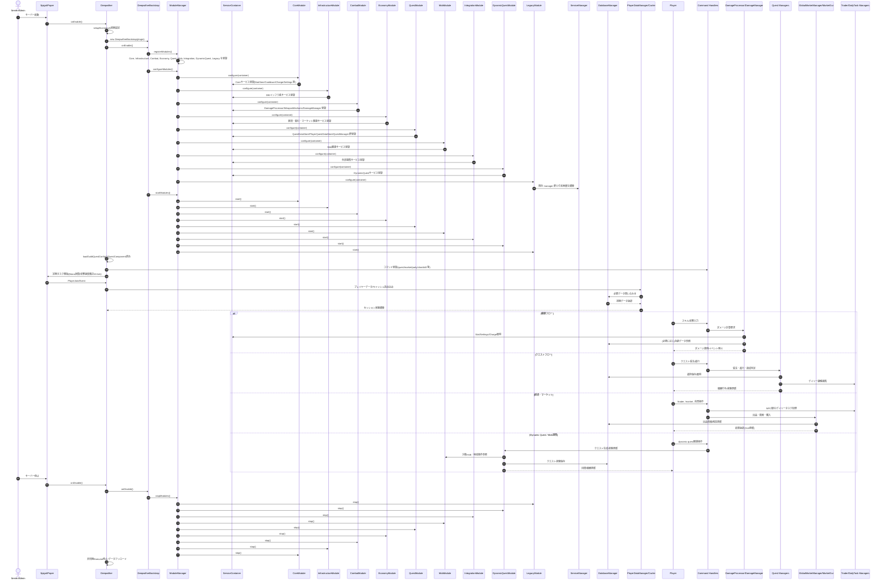

# Deepwither 全機能統合シーケンス図

以下は、Deepwither の主要機能（モジュール起動、プレイヤー接続、戦闘、クエスト、経済/マーケット、停止処理）を **1つに統合** したシーケンス図です。

```mermaid
sequenceDiagram
    autonumber
    actor Admin as Server/Admin
    participant Spigot as Spigot/Paper
    participant Plugin as Deepwither
    participant Bootstrap as DeepwitherBootstrap
    participant MM as ModuleManager
    participant SC as ServiceContainer
    participant Core as CoreModule
    participant Infra as InfrastructureModule
    participant Combat as CombatModule
    participant Eco as EconomyModule
    participant Quest as QuestModule
    participant Mob as MobModule
    participant Intg as IntegrationModule
    participant DQ as DynamicQuestModule
    participant Legacy as LegacyModule
    participant SM as ServiceManager
    participant DB as DatabaseManager
    participant PDM as PlayerDataManager/Cache
    participant Player as Player
    participant Cmd as Command Handlers
    participant Dmg as DamageProcessor/DamageManager
    participant QM as Quest Managers
    participant Market as GlobalMarketManager/MarketGui
    participant Trader as Trader/DailyTask Managers

    Admin->>Spigot: サーバー起動
    Spigot->>Plugin: onEnable()
    Plugin->>Plugin: setupEconomy()/初期設定
    Plugin->>Bootstrap: new DeepwitherBootstrap(plugin)
    Plugin->>Bootstrap: onEnable()

    Bootstrap->>MM: registerModules()
    MM->>MM: Core, Infrastructure, Combat, Economy, Quest, Mob, Integration, DynamicQuest, Legacy を登録

    Bootstrap->>MM: configureModules()
    MM->>Core: configure(container)
    Core->>SC: Coreサービス登録(Stat/Item/Cooldown/Charge/Settings 等)
    MM->>Infra: configure(container)
    Infra->>SC: DB/インフラ系サービス登録
    MM->>Combat: configure(container)
    Combat->>SC: DamageProcessor/WeaponMechanic/DamageManager 登録
    MM->>Eco: configure(container)
    Eco->>SC: 経済・取引・マーケット関連サービス登録
    MM->>Quest: configure(container)
    Quest->>SC: QuestDataStore/PlayerQuestDataStore/QuestManager 群登録
    MM->>Mob: configure(container)
    Mob->>SC: Mob関連サービス登録
    MM->>Intg: configure(container)
    Intg->>SC: 外部連携サービス登録
    MM->>DQ: configure(container)
    DQ->>SC: DynamicQuestサービス登録
    MM->>Legacy: configure(container)
    Legacy->>SM: 既存 manager 群との互換層を構築

    Bootstrap->>MM: startModules()
    MM->>Core: start()
    MM->>Infra: start()
    MM->>Combat: start()
    MM->>Eco: start()
    MM->>Quest: start()
    MM->>Mob: start()
    MM->>Intg: start()
    MM->>DQ: start()
    MM->>Legacy: start()

    Plugin->>Plugin: loadGuildQuestConfig()/QuestComponent読込
    Plugin->>Cmd: コマンド登録(quest/market/party/clan/skill 等)
    Plugin->>Spigot: 定期タスク開始(Mana回復/攻撃速度補正/AI tick)

    Spigot->>Plugin: PlayerJoin/Event
    Plugin->>PDM: プレイヤーデータ/キャッシュ読み込み
    PDM->>DB: 必要データ問い合わせ
    DB-->>PDM: 初期データ返却
    PDM-->>Plugin: セッション状態構築

    alt 戦闘フロー
        Player->>Cmd: スキル/攻撃入力
        Cmd->>Dmg: ダメージ計算要求
        Dmg->>SC: Stat/Settings/Charge取得
        Dmg->>DB: (必要に応じ)永続データ参照
        Dmg-->>Player: ダメージ適用/イベント発火
    else クエストフロー
        Player->>Cmd: クエスト受注/進行
        Cmd->>QM: 受注・進行・達成判定
        QM->>DB: 進捗保存/取得
        QM->>Trader: デイリー課題連携
        QM-->>Player: 報酬付与/状態更新
    else 経済・マーケット
        Player->>Cmd: /trader, /market, 売買操作
        Cmd->>Trader: NPC取引/デイリータスク処理
        Cmd->>Market: 出品・検索・購入
        Market->>DB: 出品情報/残高更新
        Market-->>Player: 結果返却(GUI更新)
    else Dynamic Quest / Mob連携
        Player->>Cmd: dynamic quest関連操作
        Cmd->>DQ: クエスト生成/状態更新
        DQ->>Mob: 対象mob・地域条件参照
        DQ->>DB: クエスト状態保存
        DQ-->>Player: 目標/報酬更新
    end

    Admin->>Spigot: サーバー停止
    Spigot->>Plugin: onDisable()
    Plugin->>Bootstrap: onDisable()
    Bootstrap->>MM: stopModules()
    MM->>Legacy: stop()
    MM->>DQ: stop()
    MM->>Intg: stop()
    MM->>Mob: stop()
    MM->>Quest: stop()
    MM->>Eco: stop()
    MM->>Combat: stop()
    MM->>Infra: stop()
    MM->>Core: stop()
    Plugin->>Plugin: 非同期Executor停止/データアンロード
```

> 注: 上記は「全機能を1枚に統合」するため、個別機能の内部手順は抽象化しています。詳細は各モジュール実装を参照してください。
